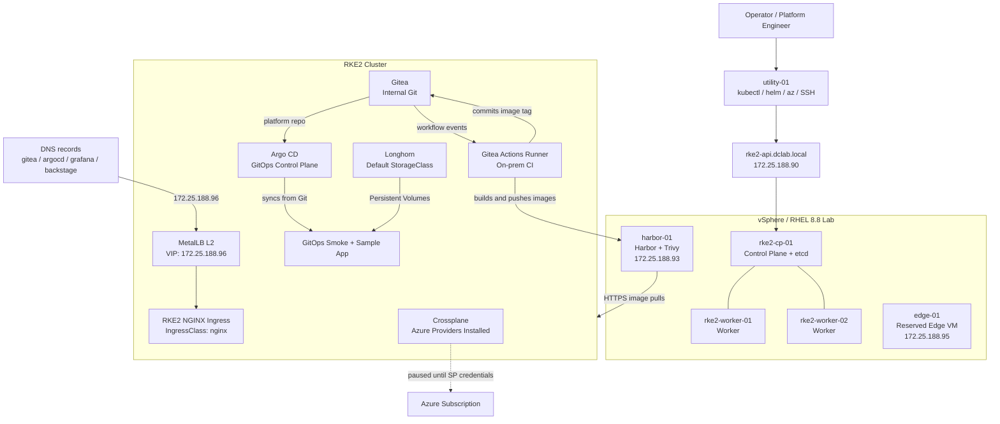

# VMware Azure Hybrid Internal Developer Platform

Production-style hybrid cloud platform lab using VMware vSphere, RKE2, Harbor, Longhorn, MetalLB, NGINX Ingress, Gitea, Argo CD, Gitea Actions, Crossplane, and Azure provider foundations.

**GitHub description:** Hybrid internal developer platform lab on VMware vSphere with RKE2, Harbor, Longhorn, MetalLB ingress, Gitea, Argo CD GitOps, Gitea Actions CI, Crossplane, and Azure provider integration.

## Core Idea

This project builds the kind of platform many enterprises actually operate: Kubernetes running on self-managed VMware infrastructure, a private registry with vulnerability scanning, persistent storage, a stable ingress layer, and a control plane ready to manage external cloud services.

The goal is not just to run Kubernetes. The goal is to build an internal developer platform where future teams can request services through Git and Kubernetes APIs while the platform handles registry, networking, storage, security, and cloud integration underneath.

## Architecture



## Component Map

| Component | Role | Current Configuration |
| --- | --- | --- |
| VMware vSphere | Enterprise-style VM infrastructure | RHEL 8.8 VMs with static networking |
| RKE2 | Self-managed Kubernetes | 1 control plane, 2 workers |
| Harbor | Private registry | HTTPS, Trivy enabled, `/data` disk |
| Longhorn | Persistent storage | Default `StorageClass` |
| MetalLB | LoadBalancer implementation | L2 mode, VIP `172.25.188.96` |
| RKE2 NGINX Ingress | HTTP/HTTPS routing | Existing bundled controller exposed via MetalLB |
| Gitea | Internal Git server | `gitadmin/platform` platform monorepo |
| Argo CD | GitOps controller | App-of-Apps with `root-app` and `gitops-smoke` |
| Gitea Actions | On-prem CI runner | Builds sample app, pushes to Harbor, commits tag to Git |
| Crossplane | Cloud control plane | Core + Azure providers healthy; Azure auth paused |
| utility-01 | Admin workstation | `kubectl`, `helm`, Azure CLI, SSH access |

## Current Status

Completed:

- RHEL 8.8 template and clone workflow
- Static DNS/IP plan for `dclab.local`
- 3-node RKE2 cluster on vSphere VMs
- Harbor registry with HTTPS and Trivy scanning
- RKE2 registry trust and Harbor pull integration
- Longhorn persistent storage as default `StorageClass`
- Crossplane core and Azure providers installed
- MetalLB L2 ingress VIP on `172.25.188.96`
- Existing RKE2 NGINX ingress exposed as `LoadBalancer`
- Gitea deployed on `gitea.dclab.local`
- Argo CD deployed on `argocd.dclab.local`
- App-of-Apps bootstrap from the internal Gitea platform repo
- GitOps smoke workload synced and updated from Git
- Gitea Actions runner deployed and registered
- CI smoke workflow passing
- Sample app build workflow pushing to Harbor and updating Git
- Argo CD syncing `sample-app` from the CI-updated manifest
- Runbooks for build commands and troubleshooting

Paused:

- Azure resource provisioning through Crossplane, blocked by Entra service principal creation permissions.

Next:

- Bring existing platform services under GitOps one at a time
- Harden Gitea Actions runner build path
- Backstage developer portal

## Access Points

| UI / Endpoint | URL | Notes |
| --- | --- | --- |
| Harbor | `https://harbor-01.dclab.local` | Requires workstation DNS or hosts entry |
| Longhorn | `http://localhost:30080` | Use SSH tunnel from workstation |
| Gitea | `http://gitea.dclab.local` | Internal Git server |
| Argo CD | `http://argocd.dclab.local` | GitOps control plane |
| Sample App | Cluster service `sample-app.sample-app.svc` | Built by Gitea Actions and synced by Argo CD |
| Future Grafana | `http://grafana.dclab.local` | DNS already points to ingress VIP |
| Future Backstage | `http://backstage.dclab.local` | DNS already points to ingress VIP |

Longhorn tunnel:

```powershell
ssh -i $env:USERPROFILE\.ssh\hybrid-cloud-idp -L 30080:172.25.188.90:30080 root@172.25.188.94
```

## Validation Snapshot

```bash
kubectl get nodes
kubectl -n metallb-system get pods
kubectl -n kube-system get svc rke2-ingress-nginx-controller-lb
kubectl -n longhorn-system get pods
kubectl get storageclass
kubectl -n gitea get pods,pvc,ingress
kubectl -n argocd get applications
kubectl -n gitea-runner get pods
kubectl -n sample-app get pods
kubectl get providers
```

Expected state:

- All RKE2 nodes `Ready`
- MetalLB pods `Running`
- Ingress service `EXTERNAL-IP=172.25.188.96`
- Longhorn pods `Running`
- `longhorn` is default storage class
- Gitea pods `Running`
- Argo CD apps `Synced` and `Healthy`
- Gitea runner pod `Running`
- Sample app pod `Running`
- Crossplane Azure providers `HEALTHY=True`

## Repository Structure

```text
.
├── ansible/
├── docs/
│   ├── decisions/
│   ├── runbooks/
│   ├── lab-guide.md
│   └── rke2-install.md
├── kubernetes/
├── terraform/
└── README.md
```

## Documentation

- [Lab Guide](docs/lab-guide.md)
- [RKE2 Install Notes](docs/rke2-install.md)
- [Runbooks](docs/runbooks/README.md)
- [Architecture Decisions](docs/decisions/)

## Why This Matters

This lab demonstrates practical platform engineering skills that map to enterprise environments:

- Self-managed Kubernetes rather than only managed cloud services
- Private registry workflows with scanning and trusted TLS
- Persistent storage for stateful platform services
- LoadBalancer and ingress design on a non-cloud Kubernetes cluster
- GitOps-ready foundations for repeatable platform delivery
- Crossplane-ready control plane for future hybrid cloud provisioning
